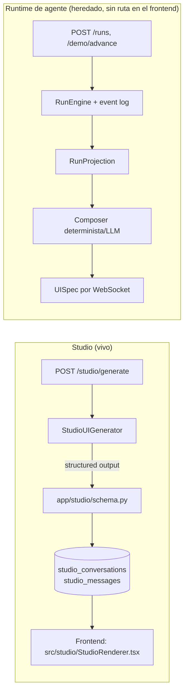

# Hack-a-ton-end · Kernel Panic

Backend FastAPI de Kernel Panic. El repositorio contiene **dos sistemas**:

1. **Studio** (`app/studio/`) — el producto vivo hoy: generación de interfaces a
   partir de un prompt de texto libre. Es lo único que el frontend actual
   (`Hack-a-ton-front`) renderiza.
2. **Runtime de agente** (`app/flow/`, `app/runtime/`, `app/synthesis/`,
   `app/policy/`, `app/ws/`, `app/demo/`) — un motor de workflows versionados
   con WebSocket, decisiones humanas y una UI generada por proyección de
   estado. Sigue completo, probado y expuesto por HTTP/WS, pero el frontend ya
   no enruta a él (ver `Hack-a-ton-front/README.md`, sección "Studio vs.
   runtime heredado"). Trátalo como un módulo estable pero dormido, no como
   trabajo en progreso.

Si vienes a trabajar en el producto, casi seguro es en Studio. El resto de
este README documenta ambos, en ese orden.

## Arranque rápido

```bash
docker compose -f docker/docker-compose.yml up -d postgres
python -m venv .venv
.venv/bin/pip install -r requirements.txt
cp .env.example .env          # agrega tu OPENAI_API_KEY para que Studio genere algo
set -a && source .env && set +a
.venv/bin/uvicorn main:app --reload --host 0.0.0.0 --port 8000
```

Verifica: `curl http://localhost:8000/health` → `{"status":"ok"}`. Swagger en
`http://localhost:8000/docs`.

`uvicorn` **no** carga `.env` solo; por eso el `source` antes de levantarlo (o
usa `docker compose up --build -d`, que sí inyecta las variables — ver más
abajo).

### Alternativa: todo con Docker

```bash
docker compose -f docker/docker-compose.yml up --build -d
docker compose -f docker/docker-compose.yml ps
curl --fail http://localhost:8000/health
```

| Servicio | URL/puerto del host | Puerto interno |
|---|---|---:|
| FastAPI | `http://localhost:8000` | `8000` |
| Swagger | `http://localhost:8000/docs` | `8000` |
| Health | `http://localhost:8000/health` | `8000` |
| PostgreSQL | `localhost:5433` | `5432` |

No ejecutes además `uvicorn` en el puerto 8000 si Compose ya levantó el backend.

## Variables de entorno

```bash
cp .env.example .env
```

| Variable | Default | Uso |
|---|---:|---|
| `BACKEND_PORT` | `8000` | Puerto de FastAPI publicado en el host (solo Compose) |
| `POSTGRES_PORT` | `5433` | Puerto de PostgreSQL publicado en el host |
| `PORT` | `8000` | Puerto interno de FastAPI en el contenedor |
| `DATABASE_URL` | Postgres local `:5433` | Override completo de conexión (Railway lo inyecta) |
| `ALLOWED_ORIGINS` | frontend `5173`/`5174`/`3000` | Lista CORS separada por comas |
| `OPENAI_API_KEY` | vacío | **Requerida para que Studio genere algo.** Sin ella, `/studio/generate` responde un layout de "interfaz no disponible" — no hay fallback determinista para prompts arbitrarios |
| `OPENAI_MODEL` | `gpt-5.4-mini` | Modelo usado por Studio y por el runtime heredado |
| `STUDIO_GENERATION_ENABLED` | `true` | Kill switch de Studio. En `false`, siempre responde el layout de "no disponible" |
| `STUDIO_GENERATION_TIMEOUT_SECONDS` | `25` | Timeout por intento contra el proveedor (Studio reintenta hasta 5 veces) |
| `DEMO_TOKEN` | placeholder | Token del handshake WebSocket del runtime heredado (no lo usa Studio) |
| `LLM_UPGRADE_ENABLED` | `true` | Kill switch del upgrade LLM del runtime heredado |
| `GENERIC_STEP_LLM_ENABLED` | `true` | Kill switch del runtime heredado para pasos creados en vivo |
| `ASSISTANT_ENABLED` | `true` | Kill switch del asistente Ari del runtime heredado |
| `SQL_ECHO` | `false` | Log detallado de SQLAlchemy |

`DEMO_TOKEN` debe coincidir con `VITE_DEMO_TOKEN` del frontend si algún día se
vuelve a enrutar `/demo`. Nunca commitees `.env`.

## Arquitectura



| Ruta | Responsabilidad |
|---|---|
| `app/studio/schema.py` | Nodos del layout de Studio (Pydantic, discriminated union) |
| `app/studio/llm.py` | Prompt al proveedor, structured output, fallback y reintentos |
| `app/studio/store.py` | Persistencia de conversaciones/mensajes/feedback |
| `app/models/studio.py` | Tablas SQLAlchemy: `studio_conversations`, `studio_messages`, `studio_conversation_feedback` |
| `app/flow/` | *(heredado)* Definiciones y versiones inmutables de workflows |
| `app/runtime/` | *(heredado)* Ejecución, transiciones y proyección de runs |
| `app/synthesis/` | *(heredado)* Composer determinista/LLM de pasos genéricos |
| `app/policy/` | *(heredado)* Validación declarativa y coordinación de acciones humanas |
| `app/ws/` | *(heredado)* Hub WebSocket en memoria por run |
| `app/demo/` | *(heredado)* Golden path, mock provider y demo driver |
| `app/schemas/contracts.py` | Contrato v1 ejecutable compartido por el runtime heredado |
| `main.py` | Aplicación FastAPI, CORS, lifecycle, healthcheck y todas las rutas |

## Studio

`POST /studio/generate` recibe `{ "prompt": "...", "conversationId"?: "...", "name"?: "..." }`
y devuelve un layout declarativo validado. Sin `conversationId`, crea un
proyecto nuevo; con él, trata el prompt como una edición del layout anterior
(reutiliza ids de nodo, conserva lo que no cambió).

### Tipos de nodo (`app/studio/schema.py`)

Contenedores: `page`, `section` (con `direction`/`gap`/`align`/`justify` y
`backgroundColor`).

Contenido: `metric`, `alert`, `timeline`, `keyValue`, `compare`, `step`, `map`
(reutilizados del contrato del runtime heredado, `app/schemas/contracts.py`),
`button`, `text`.

Interactivos y de datos (propios de Studio): `searchBar`, `dropdown`, `chart`
(bar/line/pie), `table` (hasta 250 filas), `progress`, `tags`.

- **Color:** `button`, `text`, `progress`, cada item de `tags` y cada punto de
  `chart` aceptan un `color` hex opcional (`^#[0-9a-fA-F]{6}$`); `page` y
  `section` aceptan `backgroundColor`. El modelo debe fijarlo explícitamente
  cuando el prompt pide recolorear algo — no basta con describirlo en `reason`.
- **Filtrado client-side:** `searchBar`/`dropdown` aceptan `filterTarget`
  (id de un `table`/`tags` del mismo layout) y `dropdown` además
  `filterColumn`. El backend valida que la referencia exista y apunte a un
  nodo filtrable; el filtrado en sí corre 100% en el navegador
  (`FilterContext` en `StudioRenderer.tsx`), sin round-trip.
- **`map`:** reutiliza `MapProps` del contrato heredado (waypoints, segments,
  marker); el frontend lo renderiza con el mismo `RouteMap.tsx` (MapLibre GL)
  que usaba el runtime.

Cualquier tipo o prop fuera de este esquema es rechazado por el `strict` JSON
Schema que se le pasa al proveedor — el modelo no puede inventar nodos.

### Endpoints

| Método | Ruta | Resultado |
|---|---|---|
| `POST` | `/studio/generate` | Genera o edita un layout; persiste el turno |
| `GET` | `/studio/projects` | Lista proyectos (conversaciones), más reciente primero |
| `GET` | `/studio/projects/{id}` | Historial completo de turnos de un proyecto |
| `POST` | `/studio/projects/{id}/feedback` | Califica (1–5 + comentario opcional) las generaciones recientes; se pliega en el prompt del siguiente `generate` |
| `DELETE` | `/studio/projects/{id}` | Borra el proyecto y sus turnos/feedback |

### Reintentos y presupuesto

`max_output_tokens=6000`, timeout configurable por intento
(`STUDIO_GENERATION_TIMEOUT_SECONDS`, default 25s), hasta 5 reintentos. Si
todos fallan, responde un layout de "interfaz no disponible" con el error real
en `reason` — nunca una pantalla en blanco sin explicación.

## Runtime de agente (heredado)

Sigue implementado y probado, pero **no alcanzable desde el frontend actual**
(no hay router; `App.tsx` solo renderiza Studio). Útil si retomas ese trabajo
o necesitas los endpoints directamente por HTTP/WS.

| Método | Ruta | Resultado |
|---|---|---|
| `POST` | `/demo/skeleton` | Crea un run en decisión pendiente (walking skeleton) |
| `POST` | `/runs` | Crea el run v1 del golden path |
| `POST` | `/runs` con `workflowVersionId` | Crea un run contra una versión específica |
| `POST` | `/workflows/{workflowId}/versions` | Crea v(n+1); con `baseVersion`, anexa pasos al flow base |
| `POST` | `/demo/advance` | Avanza el siguiente evento guionizado |
| `POST` | `/demo/moment/{1|2|3}` | Crea M1/M2/M3 como runs de la misma operación |
| `GET` | `/runs/{runId}/projection` | Snapshot actual (polling/reconexión) |
| `GET` | `/runs/{runId}/snapshot` | Último envelope `UI_UPDATED` completo |
| `GET` | `/runs/{runId}/events` | Event log append-only completo |
| `POST` | `/runs/{runId}/assist` | Chat de Ari: `reply`, `recommendedActions`, `proposedStep` |
| `WS` | `/ws/runs/{runId}?token=<DEMO_TOKEN>` | Reproduce la última `UI_UPDATED` y emite transiciones |

`app/schemas/contracts.py` es la autoridad ejecutable de este contrato
(`RunEvent`, `RunProjection`, `UISpec` con diez primitivas incluido `map`,
`ActionEvent`, envelope WS tipado, IDs prefijados). El espejo TypeScript vive
en `Hack-a-ton-front/src/runtime/contracts.ts` — si tocas este archivo,
actualiza ambos lados en el mismo cambio.

## Pruebas

```bash
.venv/bin/python -m unittest discover -s tests -v
.venv/bin/python -m compileall -q app main.py
docker compose -f docker/docker-compose.yml config --quiet
```

No requiere `pytest` (aunque también funciona si lo instalas). Con el stack
levantado, los smoke scripts reproducen los flujos del runtime heredado:

```bash
.venv/bin/python scripts/smoke_phase2.py --base-url http://127.0.0.1:8000 --token "$DEMO_TOKEN"
.venv/bin/python scripts/smoke_phase3.py --base-url http://127.0.0.1:8000 --token "$DEMO_TOKEN"
.venv/bin/python scripts/smoke_phase4.py --base-url http://127.0.0.1:8000 --token "$DEMO_TOKEN"
.venv/bin/python scripts/smoke_phase5.py --base-url http://127.0.0.1:8000 --expected-generator deterministic --token "$DEMO_TOKEN"
```

## Problema conocido: no hay migraciones de esquema

El backend crea tablas con `Base.metadata.create_all()` al arrancar
(`main.py`, evento `lifespan`). Eso **crea tablas que faltan pero nunca altera
una tabla que ya existe**. Si agregas una columna a un modelo (por ejemplo,
`StudioMessageModel.suggestion`), cualquier base de datos que ya tuviera esa
tabla creada por una versión anterior del modelo se queda desincronizada y
revienta en producción con `UndefinedColumnError` (500, y sin headers CORS en
la respuesta — Starlette no le da chance a `CORSMiddleware` de correr en una
excepción no manejada, así que el navegador lo reporta como error de CORS
aunque el problema real sea este).

Síntoma: cualquier endpoint que toque la columna nueva responde 500. Se
soluciona a mano contra la base afectada:

```sql
ALTER TABLE studio_messages ADD COLUMN IF NOT EXISTS suggestion TEXT;
```

En Railway: dashboard del servicio Postgres → pestaña "Data"/"Query", o
`psql "<connection-url>" -c "..."` con el connection string de la pestaña
"Connect". Esto va a repetirse con cualquier futura columna nueva mientras no
se adopte una herramienta de migraciones (p. ej. Alembic) — es la mejora
pendiente más clara del proyecto.

## Apagado

```bash
docker compose -f docker/docker-compose.yml down
```

El volumen de PostgreSQL se conserva. Usa `down -v` solo cuando quieras borrar
deliberadamente todos los datos locales.
