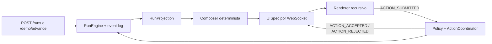

# Hack-a-ton-end · NextWave 2026 Challenge 03

Backend FastAPI del runtime de agentes de Kernel Panic. La rama `dev` contiene
la arquitectura modular vigente: workflows versionados, reducer de runs, event
log append-only, fixture/demo driver y contratos Pydantic compartidos. Consulta
`AGENTS.md` para el roadmap y los gates de entrega.

## Arquitectura actual

| Ruta | Responsabilidad |
|---|---|
| `app/flow/` | Definiciones y versiones inmutables de workflows |
| `app/runtime/` | Ejecución, transiciones y proyección de runs |
| `app/synthesis/` | Composer determinista/LLM y structured output de pasos genéricos |
| `app/policy/` | Validación declarativa y coordinación de acciones humanas |
| `app/ws/` | Hub WebSocket en memoria por run y envelopes tipados |
| `app/demo/` | Golden path, mock provider y demo driver |
| `app/models/` | Tablas SQLAlchemy de workflows, runs, eventos y decisiones |
| `app/schemas/contracts.py` | Contrato v1 ejecutable para backend/frontend/WS |
| `main.py` | Aplicación FastAPI, CORS, lifecycle y healthcheck |

La arquitectura Controller–Service–Repository del template anterior ya no es
la estructura principal del runtime. Los módulos se organizan por capacidad del
roadmap y comparten PostgreSQL dentro del mismo monolito modular.



## Requisitos

- Docker con Docker Compose para el flujo recomendado.
- Python 3.12+ solamente si se ejecutará FastAPI fuera de Docker.

## Variables de entorno

```bash
cp .env.example .env
```

| Variable | Default | Uso |
|---|---:|---|
| `BACKEND_PORT` | `8000` | Puerto de FastAPI publicado en el host |
| `POSTGRES_PORT` | `5433` | Puerto de PostgreSQL publicado en el host |
| `PORT` | `8000` | Puerto interno de FastAPI en el contenedor |
| `DEMO_TOKEN` | placeholder | Token compartido del handshake WebSocket de demo |
| `ALLOWED_ORIGINS` | frontend `5173`/`5174`/`3000` | Lista CORS separada por comas |
| `OPENAI_API_KEY` | vacío | Activa el upgrade progresivo de `UISpec` |
| `OPENAI_MODEL` | `gpt-5.4-mini` | Modelo usado por Responses API |
| `LLM_UPGRADE_ENABLED` | `true` | Kill switch; sin key siempre usa determinista |
| `GENERIC_STEP_LLM_ENABLED` | `true` | Kill switch del análisis LLM para pasos creados en runtime |
| `SQL_ECHO` | `false` | Activa explícitamente el log detallado de SQLAlchemy |

`DEMO_TOKEN` debe coincidir con `VITE_DEMO_TOKEN` del frontend. Es un control
exclusivo de la demo, no una credencial de producción. Nunca commitees `.env`.

## Fase 3 · decisión humana y síntesis progresiva

Cada transición publica y persiste primero una `UISpec` determinista. Si
`OPENAI_API_KEY` está disponible, `app/synthesis/llm.py` solicita después una
mejora con structured outputs, timeout de 5 segundos y un retry. Pydantic
revalida el árbol y el backend conserva bajo su autoridad IDs, versiones y
`availableActions`; cualquier fallo mantiene intacta la UI determinista.

`GET /runs/{id}/snapshot` devuelve el último envelope `UI_UPDATED` completo
para reconexión y polling. El WebSocket sigue reproduciendo el mismo snapshot
al conectarse y aplica el policy engine antes de aceptar una decisión.

### Prueba manual de la mejora LLM

Con `OPENAI_API_KEY` en `.env`, este comando realiza una sola llamada real
contra la fixture grabada. Solo imprime modelo, latencia y el resultado de la
validación; nunca muestra la clave ni el layout completo.

```powershell
.venv\Scripts\python.exe -m app.synthesis.smoke_llm
```

Para comprobar el flujo progresivo con Postman o Insomnia, crea un run con
`POST /runs`, espera unos segundos y consulta:

```text
GET http://localhost:8000/runs/run_<uuid>/snapshot
```

El envelope tendrá `payload.uiSpec.generatedBy: "llm"` cuando el upgrade se
publique; si el proveedor falla, el snapshot determinista permanece disponible.

## Fase 5 · fallbacks y freeze

La API siempre persiste y publica primero una `UISpec` determinista a partir de
`RunProjection`. Los upgrades externos son opcionales: con ambos kill switches
en `false`, el golden path, las decisiones y los pasos genéricos siguen
funcionando sin red ni clave de proveedor.

```env
LLM_UPGRADE_ENABLED=false
GENERIC_STEP_LLM_ENABLED=false
SQL_ECHO=false
```

El smoke HTTP verifica que un payload real produce un snapshot `UI_UPDATED`,
que sus versiones coinciden y que el árbol solo usa los nueve tipos del
registry. Acepta una URL directa del backend o el proxy `/api` del frontend:

```bash
.venv/bin/python scripts/smoke_phase5.py \
  --base-url http://127.0.0.1:8000 \
  --expected-generator deterministic \
  --token "$DEMO_TOKEN"
```

Usa `--expected-generator llm` únicamente cuando `OPENAI_API_KEY` esté
configurada y el upgrade progresivo deba formar parte de la prueba.

## Fase 4 · trial-by-fire

`POST /workflows/{workflowId}/versions` acepta `baseVersion` junto con los pasos
nuevos. El backend copia esa versión inmutable y anexa las definiciones del
request; así el paso inventado se ejecuta después del flow base y puede resolver
rutas reales como `delivery_eta.data.final_eta`.

Cuando el mock provider no reconoce el paso, `GenericStepExecutor` resuelve sus
inputs desde el estado, produce el fallback determinista y usa el structured
output LLM cuando está disponible. `requiresHumanReview` pausa el run con
`act_acknowledge`; al aceptarlo, el paso registra `STEP_COMPLETED` antes de
continuar o cerrar el run.

El trial completo, incluido WebSocket, timeline, `UISpec` y export del event
log, se reproduce con:

```bash
python scripts/smoke_phase4.py \
  --base-url http://127.0.0.1:8000 \
  --token "$DEMO_TOKEN"
```

## Inicio recomendado: backend completo con Docker

Desde la raíz del repositorio:

```bash
docker compose -f docker/docker-compose.yml up --build -d
docker compose -f docker/docker-compose.yml ps
curl --fail http://localhost:8000/health
```

Servicios publicados:

| Servicio | URL/puerto del host | Puerto interno |
|---|---|---:|
| FastAPI | `http://localhost:8000` | `8000` |
| Swagger | `http://localhost:8000/docs` | `8000` |
| Health | `http://localhost:8000/health` | `8000` |
| PostgreSQL | `localhost:5433` | `5432` |

Compose ya levanta FastAPI; no ejecutes además `uvicorn` en el puerto 8000.

Si esos puertos están ocupados, cambia `.env` sin editar Compose:

```env
BACKEND_PORT=18000
POSTGRES_PORT=15433
```

En ese caso, el healthcheck queda en `http://localhost:18000/health`. Si el
frontend apunta directamente al backend, actualiza también `VITE_API_URL`.

## Desarrollo local de FastAPI

Levanta solamente PostgreSQL y ejecuta la API en el host:

```bash
docker compose -f docker/docker-compose.yml up -d postgres
python -m venv .venv
.venv/bin/pip install -r requirements.txt
.venv/bin/uvicorn main:app --reload --host 0.0.0.0 --port 8000
```

La configuración Python usa por defecto PostgreSQL en `localhost:5433`. Si
cambias `POSTGRES_PORT`, define una `DATABASE_URL` equivalente para Uvicorn.

## Contratos v1

`app/schemas/contracts.py` es la autoridad ejecutable. Incluye:

- `RunEvent` append-only y `RunProjection`.
- `UISpec` con `reason` obligatorio y las nueve primitivas autorizadas.
- `ActionEvent` sin `eventId` creado por cliente.
- Envelope WebSocket tipado y los doce mensajes de servidor P0.
- IDs wire prefijados (`run_`, `wf_`, `step_`, `act_`, etc.).

El runtime conserva UUIDs y step IDs internos; `RunEngine.get_projection()` los
adapta al contrato wire sin cambiar la persistencia de la arquitectura nueva.

## HTTP del runtime (Rol A)

Estos endpoints no dependen del WebSocket y permiten conducir y recuperar la
demo por HTTP. Los identificadores devueltos usan el formato wire (`run_<uuid>`).

| Método | Ruta | Resultado |
|---|---|---|
| `POST` | `/demo/skeleton` | Crea un run en decisión pendiente y publica la `UISpec` mínima para verificar G1. |
| `POST` | `/runs` | Crea el run v1 del golden path y devuelve su `RunProjection` inicial. |
| `POST` | `/runs` con `workflowVersionId` | Crea un run contra una versión inmutable específica. |
| `POST` | `/workflows/{workflowId}/versions` | Crea v(n+1); con `baseVersion`, preserva el flow base y anexa los pasos nuevos. |
| `POST` | `/demo/advance` | Recibe `{"runId":"run_<uuid>"}`, aplica el siguiente evento guionizado y devuelve la proyección. |
| `GET` | `/runs/{runId}/projection` | Devuelve el snapshot actual para polling/reconexión. |
| `GET` | `/runs/{runId}/events` | Devuelve el event log append-only completo como `RunEvent[]`. |
| `WS` | `/ws/runs/{runId}?token=<DEMO_TOKEN>` | Reproduce la última `UI_UPDATED` y emite las transiciones posteriores. |

Ejemplo de avance:

```bash
curl -X POST http://localhost:8000/runs
curl -X POST http://localhost:8000/demo/advance \
  -H 'content-type: application/json' \
  -d '{"runId":"run_<uuid-devuelto>"}'
```

Tras crear o avanzar un run, el pipeline determinista compone una `UISpec`, la
persiste dentro del estado del run y emite `UI_UPDATED`. Al conectarse, el WS
reproduce esa última actualización; el contrato congelado de `/projection`
sigue devolviendo exclusivamente `RunProjection`.

El socket también recibe `ACTION_SUBMITTED`. El handler contrasta run,
workflow/state version, decisión pendiente, acción y payload; registra la
decisión y responde `ACTION_ACCEPTED`, o agrega un evento append-only y devuelve
`ACTION_REJECTED` con una razón legible. Una acción aceptada publica de inmediato
la nueva `UI_UPDATED`.

## Pruebas

```bash
.venv/bin/python -m unittest discover -s tests -v
.venv/bin/python -m compileall -q app main.py
docker compose -f docker/docker-compose.yml config --quiet
```

Con el stack levantado, el smoke reproducible verifica G1 y el golden path de
cinco pasos hasta `completed`:

```bash
.venv/bin/python scripts/smoke_phase2.py \
  --base-url http://127.0.0.1:8000 \
  --token "$DEMO_TOKEN"
.venv/bin/python scripts/smoke_phase3.py \
  --base-url http://127.0.0.1:8000 \
  --token "$DEMO_TOKEN"
.venv/bin/python scripts/smoke_phase4.py \
  --base-url http://127.0.0.1:8000 \
  --token "$DEMO_TOKEN"
.venv/bin/python scripts/smoke_phase5.py \
  --base-url http://127.0.0.1:8000 \
  --expected-generator deterministic \
  --token "$DEMO_TOKEN"
```

Las pruebas cubren contratos, composer, policy, pipeline, demo driver,
decisiones por WS, rechazo stale, pasos inventados, revisión humana, event log
y adaptación a `RunProjection`.

## Apagado

```bash
docker compose -f docker/docker-compose.yml down
```

El volumen de PostgreSQL se conserva. Usa `down -v` solo cuando quieras borrar
deliberadamente todos los datos locales del proyecto.
